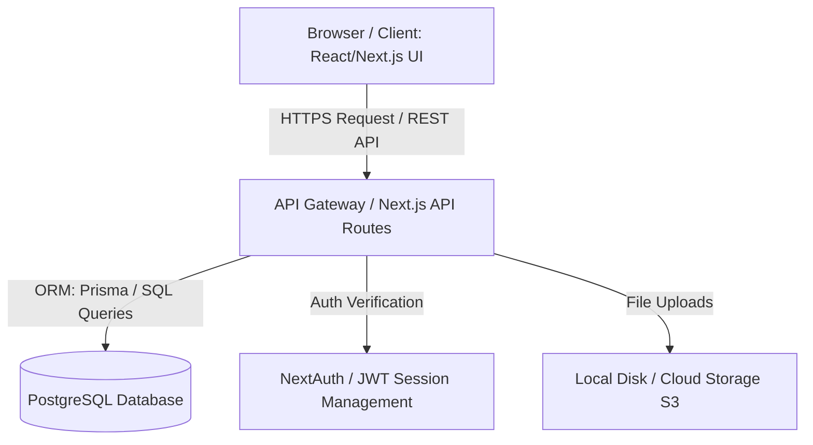
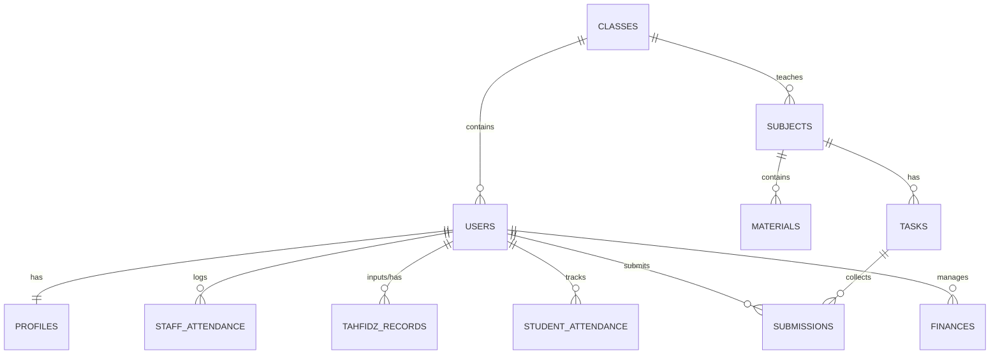

# TECHNICAL ARCHITECTURE DOCUMENT (EduFlow)

Dokumen ini mendefinisikan desain sistem, skema database, kontrak API, keputusan teknologi (ADR), dan kebutuhan non-fungsional untuk sistem **EduFlow (LMS & Operasional Sekolah)**.

---

## 1. System Architecture Diagram

Sistem dirancang menggunakan arsitektur **Monolith Modern (Option A)** berbasis **Next.js** (App Router) dengan backend terintegrasi (Next.js API Routes/Node.js) dan database relasional **PostgreSQL**.

### Penjelasan Komponen:
1. **Client Layer:** User Interface responsif dibangun menggunakan React/Next.js dengan CSS kustom.
2. **Next.js API Routes (Backend):** Bertindak sebagai application server yang memproses logika bisnis dan verifikasi hak akses (role-based access control).
3. **PostgreSQL Database:** Menyimpan data terstruktur mulai dari profil pengguna, nilai akademis, kehadiran staf, catatan keuangan, hingga progres Tahfidz.
4. **JWT Session Management:** Menyimpan sesi login aman di browser secara terenkripsi (Secure HttpOnly Cookies).

---

## 2. Database Design (Entity Relationship Diagram)

Skema database relasional dirancang menggunakan database **PostgreSQL**.

### Detail Tabel & Kolom (Schema Specification)

#### A. Tabel `users` (Data Akun Login)
* `id` (UUID, Primary Key, Auto-generate)
* `email` (VARCHAR, Unique, Indexed)
* `password_hash` (VARCHAR)
* `role` (VARCHAR) — Pilihan: `'admin'`, `'guru'`, `'siswa'`, `'orang_tua'`
* `nama` (VARCHAR)
* `created_at` (TIMESTAMP, Default: NOW)
* `updated_at` (TIMESTAMP, Default: NOW)

#### B. Tabel `profiles` (Data Tambahan Sesuai Role)
* `id` (UUID, Primary Key)
* `user_id` (UUID, Foreign Key -> `users.id`, Cascade Delete)
* `parent_id` (UUID, Foreign Key -> `users.id`, Nullable) — Khusus Siswa untuk menghubungkan ke Orang Tua
* `class_id` (UUID, Foreign Key -> `classes.id`, Nullable) — Khusus Siswa
* `nisn_or_nip` (VARCHAR, Nullable, Indexed)
* `alamat` (TEXT, Nullable)
* `telepon` (VARCHAR, Nullable)

#### C. Tabel `classes` (Data Kelas)
* `id` (UUID, Primary Key)
* `name` (VARCHAR, Indexed) — Contoh: "Kelas 10-A", "Kelas 11-B"
* `description` (TEXT, Nullable)

#### D. Tabel `subjects` (Mata Pelajaran)
* `id` (UUID, Primary Key)
* `name` (VARCHAR) — Contoh: "Matematika", "Bahasa Inggris"
* `code` (VARCHAR) — Contoh: "MATH101"
* `class_id` (UUID, Foreign Key -> `classes.id`)
* `teacher_id` (UUID, Foreign Key -> `users.id`) — Guru pengampu

#### E. Tabel `materials` (Materi Belajar)
* `id` (UUID, Primary Key)
* `subject_id` (UUID, Foreign Key -> `subjects.id`)
* `title` (VARCHAR)
* `description` (TEXT)
* `file_url` (VARCHAR) — Path penyimpanan dokumen (PDF/PPT)
* `created_at` (TIMESTAMP)

#### F. Tabel `tasks` (Tugas)
* `id` (UUID, Primary Key)
* `subject_id` (UUID, Foreign Key -> `subjects.id`)
* `title` (VARCHAR)
* `description` (TEXT)
* `deadline` (TIMESTAMP)

#### G. Tabel `submissions` (Pengumpulan Tugas Siswa)
* `id` (UUID, Primary Key)
* `task_id` (UUID, Foreign Key -> `tasks.id`)
* `student_id` (UUID, Foreign Key -> `users.id`)
* `file_url` (VARCHAR) — Tugas yang diunggah siswa
* `score` (INTEGER, Nullable) — Nilai dari guru (0-100)
* `graded_at` (TIMESTAMP, Nullable)
* `created_at` (TIMESTAMP)

#### H. Tabel `student_attendance` (Absensi Siswa)
* `id` (UUID, Primary Key)
* `student_id` (UUID, Foreign Key -> `users.id`)
* `date` (DATE, Indexed)
* `status` (VARCHAR) — `'hadir'`, `'sakit'`, `'izin'`, `'alpa'`
* `notes` (TEXT, Nullable)

#### I. Tabel `staff_attendance` (Absensi Staf & Guru)
* `id` (UUID, Primary Key)
* `staff_id` (UUID, Foreign Key -> `users.id`)
* `date` (DATE, Indexed)
* `clock_in` (TIMESTAMP, Nullable)
* `clock_out` (TIMESTAMP, Nullable)
* `status` (VARCHAR) — `'hadir'`, `'izin'`, `'alpa'`

#### J. Tabel `tahfidz_records` (Catatan Hafalan Quran)
* `id` (UUID, Primary Key)
* `student_id` (UUID, Foreign Key -> `users.id`)
* `teacher_id` (UUID, Foreign Key -> `users.id`) — Guru yang menyimak
* `date` (DATE)
* `surah_name` (VARCHAR)
* `start_ayat` (INTEGER)
* `end_ayat` (INTEGER)
* `status` (VARCHAR) — `'lancar'`, `'kurang_lancar'`, `'perlu_diulang'`
* `notes` (TEXT, Nullable)

#### K. Tabel `finances` (Keuangan Sekolah)
* `id` (UUID, Primary Key)
* `type` (VARCHAR) — `'masuk'`, `'keluar'`
* `amount` (DECIMAL(12,2))
* `category` (VARCHAR) — Contoh: `'spp'`, `'donasi'`, `'gaji'`, `'operasional'`, `'listrik'`
* `description` (TEXT)
* `date` (DATE, Indexed)
* `created_by` (UUID, Foreign Key -> `users.id`)

---

## 3. API Contract Design (MVP Endpoints)

Seluruh request API menggunakan format JSON (`application/json`) dan membutuhkan token authorization Bearer JWT (kecuali login).

| Method | Endpoint | Auth Required | Description | Complexity |
| :--- | :--- | :--- | :--- | :--- |
| **POST** | `/api/auth/login` | None | Autentikasi user & pemberian JWT cookie | S |
| **POST** | `/api/auth/logout` | All | Penghapusan sesi aktif | S |
| **GET** | `/api/users/profile` | All | Mendapatkan profil user aktif beserta rolenya | S |
| **POST** | `/api/admin/users` | Admin | Membuat user baru (Guru/Siswa/Orang Tua) | M |
| **GET** | `/api/admin/users` | Admin | List & filter data guru/siswa | M |
| **POST** | `/api/guru/attendance/student` | Guru | Input absensi siswa harian | M |
| **GET** | `/api/guru/attendance/student` | Guru | Rekap absensi siswa per kelas | M |
| **POST** | `/api/materials` | Guru | Upload materi pembelajaran | S |
| **POST** | `/api/tasks` | Guru | Buat tugas baru | S |
| **POST** | `/api/submissions` | Siswa | Kirimkan pengumpulan tugas | M |
| **PATCH** | `/api/submissions/:id/grade`| Guru | Memberikan nilai pada tugas siswa | S |
| **POST** | `/api/staff/attendance/in` | Guru/Staf | Melakukan pencatatan absen masuk (clock in) | M |
| **POST** | `/api/staff/attendance/out`| Guru/Staf | Melakukan pencatatan absen pulang (clock out) | M |
| **GET** | `/api/admin/attendance/staff`| Admin | Rekap absensi bulanan seluruh staf | M |
| **POST** | `/api/admin/finance/transaction`| Admin | Input transaksi kas masuk/keluar baru | M |
| **GET** | `/api/admin/finance/summary` | Admin | Ringkasan cashflow masuk, keluar, dan saldo | M |
| **POST** | `/api/guru/tahfidz` | Guru | Input setoran hafalan siswa | M |
| **GET** | `/api/student/tahfidz/:id` | Siswa/Ortu | Rekap histori setoran hafalan siswa | M |

---

## 4. ADR (Architecture Decision Record)

### ADR-01: Pemilihan Database Relasional (PostgreSQL)
* **Konteks:** Sistem membutuhkan integritas data yang sangat ketat karena mengelola data keuangan sekolah, rekap kehadiran yang mempengaruhi gaji, serta relasi kompleks antar pengguna (misal: Orang tua yang terhubung ke satu atau lebih Siswa).
* **Keputusan:** Menggunakan PostgreSQL.
* **Alasan:** PostgreSQL mendukung transaksi ACID penuh, memiliki performa indexing yang luar biasa pada kolom pencarian (seperti tanggal absensi/keuangan), dan sangat stabil untuk data terelasi.

### ADR-02: Next.js API Routes (Monolith Architecture)
* **Konteks:** Tim terdiri dari satu developer utama dan proyek harus dirilis secepatnya. Arsitektur microservices akan menambah overhead setup yang memperlambat rilis.
* **Keputusan:** Menggunakan Next.js API Routes untuk menyatukan frontend dan backend API dalam satu repositori (Monolith).
* **Alasan:** Menghemat waktu deployment, menyederhanakan pengelolaan kode, dan memudahkan sinkronisasi tipe data antara sisi klien dan server.

---

## 5. Non-Functional Requirements (NFR)

* **Keamanan Data Keuangan:** Nilai nominal dienkripsi dalam proses transfer (HTTPS enforced) dan otorisasi ketat di level API agar halaman keuangan hanya bisa diakses oleh role Admin.
* **Kecepatan API:** Endpoint absensi staf dan input nilai harus merespons kurang dari **200ms** di lingkungan staging.
* **Ketahanan Kehadiran (Clock-in):** Absen masuk staf direkam menggunakan penanda waktu (timestamp) dari server database untuk menghindari manipulasi waktu lokal dari komputer pengguna.
