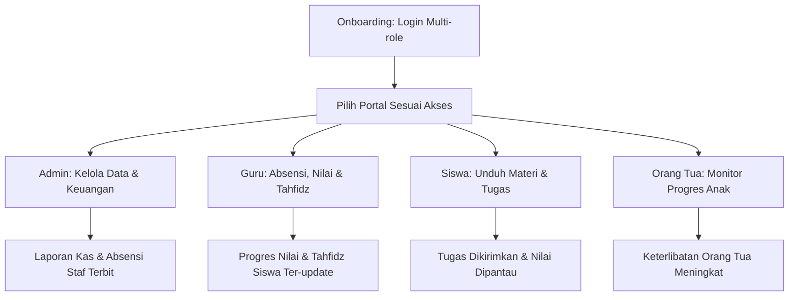

# REQUIREMENTS DOCUMENT

## 1. BRD (Business Requirements Document)

### Problem Statement
Sekolah menghadapi tantangan besar dalam mengelola informasi akademik, administrasi harian, setoran Tahfidz, absensi staf, dan keuangan sekolah secara manual dan fragmented (terpisah-pisah). Ketiadaan sistem yang terintegrasi menyebabkan hilangnya transparansi bagi orang tua, ketidakefisienan operasional bagi guru dan staf, serta potensi kebocoran arus kas sekolah.

### Objectives & Success Metrics (KPI)
* **Digitalisasi Operasional 100%:** Seluruh catatan absensi siswa/staf, nilai, Tahfidz, dan kas keuangan tercatat di sistem digital.
* **Efisiensi Waktu Guru/Staf:** Memotong waktu rekap absensi harian dan input nilai sebesar 50%.
* **Keterlibatan Orang Tua:** 90% orang tua memantau perkembangan nilai, kehadiran, dan Tahfidz anak secara aktif.
* **Transparansi Keuangan:** Zero errors pada pencatatan kas masuk dan keluar harian.

### Scope (In Scope & Out of Scope)
* **In Scope (Masuk Skala Proyek):**
  * Portal Admin, Guru/Staf, Siswa, dan Orang Tua.
  * Manajemen data guru, siswa, kelas, dan mapel.
  * Absensi harian (siswa & staf).
  * Manajemen materi (PDF/Link) & pengumpulan tugas siswa.
  * Catatan setoran hafalan Tahfidz (Surah, Ayat, Kelancaran).
  * Pencatatan keuangan manual (uang masuk & keluar) beserta ringkasan cashflow.
* **Out of Scope (Di Luar Skala Proyek):**
  * Integrasi gerbang pembayaran otomatis (Payment Gateway) di fase awal.
  * Pembuatan aplikasi native mobile (Android/iOS).
  * Modul gaji staf terintegrasi otomatis.

### Assumptions & Constraints
* **Assumptions:** Pengguna memiliki akses internet stabil dan browser modern untuk mengakses dashboard.
* **Constraints:** Versi awal dikembangkan sebagai aplikasi web responsif tanpa aplikasi mobile terpisah.

### Stakeholders & Approval Chain
* **Project Owner / Stakeholder Utama:** User (Product Owner)
* **Developer & Quality Assurance:** Antigravity AI
* **Approval Chain:** Semua perubahan status fitur dan rilis wajib disetujui oleh User.

---

## 2. User Personas

### Persona 1: Pak Budi (Administrator Sekolah / Kepala Sekolah)
* **Usia:** 45 Tahun
* **Pekerjaan:** Kepala Tata Usaha & Kepala Sekolah
* **Goals:**
  * Memantau seluruh arus kas sekolah (uang masuk & keluar) secara transparan.
  * Melihat rekap kehadiran guru/staf dengan cepat untuk penggajian.
* **Frustrations:**
  * Laporan keuangan sering terlambat dan sulit dibaca jika masih dicatat di buku kas fisik atau excel terpisah.

### Persona 2: Bu Siti (Guru & Pengajar Tahfidz)
* **Usia:** 32 Tahun
* **Pekerjaan:** Guru Kelas & Pembimbing Tahfidz
* **Goals:**
  * Mencatat kehadiran siswa dan input nilai tugas secara cepat tanpa kertas.
  * Melacak progres setoran hafalan Quran siswa per minggu.
* **Frustrations:**
  * Menghabiskan waktu terlalu lama untuk membuat rekap nilai dan absensi secara manual di akhir semester.

### Persona 3: Pak Andi (Orang Tua Murid)
* **Usia:** 38 Tahun
* **Pekerjaan:** Karyawan Swasta
* **Goals:**
  * Memantau perkembangan hafalan Tahfidz dan absensi anaknya setiap hari tanpa harus menelpon guru.
* **Frustrations:**
  * Seringkali baru mengetahui anaknya tidak masuk sekolah atau nilainya turun saat pembagian rapor di akhir semester.

---

## 3. User Journey Map (Core Flow)

---

## 4. User Stories (Minimal 20 Stories)

| ID | As a... (Role) | I want to... (Action) | So that... (Benefit) | Priority | Acceptance Criteria (AC) |
| :--- | :--- | :--- | :--- | :--- | :--- |
| US-01 | Admin | Login ke dashboard admin | Saya bisa mengelola sistem sekolah | Must Have | Input email & password valid mengarahkan ke dashboard admin. Role lain ditolak. |
| US-02 | Guru | Login ke dashboard guru | Saya bisa menginput tugas dan materi | Must Have | Pengguna dengan role Guru berhasil masuk ke portal Guru. |
| US-03 | Siswa | Login ke portal siswa | Saya bisa melihat materi pembelajaran | Must Have | Pengguna dengan role Siswa berhasil melihat jadwal dan materi. |
| US-04 | Orang Tua | Login ke portal orang tua | Saya bisa memantau anak saya | Must Have | Pengguna dengan role Orang Tua hanya melihat data anak mereka sendiri. |
| US-05 | Admin | Menambah data guru baru | Guru tersebut bisa mengakses sistem | Must Have | Tombol tambah guru, form isian (nama, NIP, email), validasi email unik. |
| US-06 | Admin | Menambah data siswa baru | Siswa terdaftar di kelas yang benar | Must Have | Form input siswa baru dengan dropdown pemilihan kelas yang aktif. |
| US-07 | Guru | Mencatat absensi siswa harian | Data kehadiran terekam secara digital | Must Have | Terdapat opsi: Hadir, Sakit, Izin, Alpa untuk setiap siswa di kelas tersebut. |
| US-08 | Guru | Mengunggah materi belajar | Siswa dapat membacanya kapan saja | Must Have | Upload file (PDF) atau input link URL dengan judul materi dan mata pelajaran. |
| US-09 | Guru | Membuat tugas baru | Siswa mengetahui tenggat waktu tugas | Must Have | Form isian tugas berupa judul, deskripsi, tenggat waktu (deadline), dan bobot nilai. |
| US-10 | Siswa | Mengunduh materi belajar | Saya bisa belajar secara mandiri | Must Have | Siswa dapat mengeklik link materi dan mengunduh file PDF yang disediakan. |
| US-11 | Siswa | Mengirim tugas secara online | Guru bisa memeriksa pekerjaan saya | Must Have | Siswa dapat mengunggah file tugas sebelum batas tenggat waktu terlewati. |
| US-12 | Guru | Menginput nilai tugas siswa | Siswa dan orang tua mengetahui hasilnya | Must Have | Daftar siswa dengan kolom input nilai angka (0-100) dan tombol simpan. |
| US-13 | Orang Tua | Memantau rekap absensi anak | Saya tahu anak saya hadir di sekolah | Must Have | Tampilan kalender kehadiran anak dengan persentase kehadiran bulanan. |
| US-14 | Orang Tua | Memantau nilai tugas anak | Saya bisa membimbing anak belajar | Must Have | Halaman berisi daftar nilai tugas akademik anak per mata pelajaran. |
| US-15 | Guru / Staf | Melakukan absen masuk | Jam kedatangan saya tercatat resmi | Must Have | Tombol "Absen Masuk" dengan timestamp server yang tidak bisa dimanipulasi. |
| US-16 | Guru / Staf | Melakukan absen pulang | Jam pulang saya tercatat resmi | Must Have | Tombol "Absen Pulang" aktif setelah absen masuk diselesaikan. |
| US-17 | Admin | Memantau absensi staf | Saya bisa merekap jam kerja guru/staf | Must Have | Tabel rekapitulasi absen bulanan seluruh guru dan staf administrasi. |
| US-18 | Admin | Mencatat uang masuk | Kas sekolah dari SPP/donasi tercatat | Must Have | Form input uang masuk: nominal, tanggal, kategori (SPP/Uang Pangkal/Donasi), keterangan. |
| US-19 | Admin | Mencatat uang keluar | Pengeluaran operasional terkendali | Must Have | Form input uang keluar: nominal, tanggal, kategori (Gaji/Listrik/Buku), keterangan. |
| US-20 | Admin | Melihat ringkasan cashflow | Saya mengetahui saldo bersih sekolah | Must Have | Widget total uang masuk, total uang keluar, dan sisa saldo di halaman utama admin. |
| US-21 | Guru Tahfidz | Menginput setoran hafalan | Perkembangan hafalan anak tercatat | Should Have | Pilihan nama siswa, nama Surah (dropdown), nomor Ayat, dan status kelancaran. |
| US-22 | Orang Tua | Memantau progres Tahfidz | Saya tahu perkembangan hafalan anak | Should Have | Halaman riwayat setoran hafalan anak lengkap dengan tanggal setoran. |

---

## 5. MVP Feature List (P0, P1, P2)

### P0 (Must Have)
1. **Core Platform:** Sistem multi-role login (Admin, Guru, Siswa, Orang Tua).
2. **Data Management:** Manajemen profil Guru, Siswa, Orang Tua, Kelas, dan Mapel (CRUD).
3. **LMS Dasar:** Upload materi oleh Guru, unduh materi & upload tugas oleh Siswa, input nilai oleh Guru.
4. **Absensi Siswa:** Input absensi harian kelas oleh Guru.
5. **Absensi Staf:** Fitur jam masuk & jam pulang untuk guru/staf, rekapitulasi oleh Admin.
6. **Keuangan Dasar:** Input pemasukan & pengeluaran sekolah secara manual, dashboard ringkasan arus kas (cashflow).

### P1 (Should Have)
1. **Modul Tahfidz:** Pencatatan setoran hafalan Qur'an siswa & visualisasi progres hafalan.
2. **Broadcast Pengumuman:** Pengiriman info sekolah dari Admin ke portal seluruh pengguna.
3. **Export PDF:** Unduh rapor nilai digital dan rekap kas keuangan bulanan.

### P2 (Nice to Have)
1. **Kalender Kegiatan:** Kalender digital interaktif untuk agenda sekolah.
2. **Forum Chat Diskusi:** Komunikasi real-time di bawah setiap materi pelajaran.

---

## 6. R&D Feature Recommendation

### Competitor Benchmark
* **Competitor A (Google Classroom):** Sangat baik untuk LMS & tugas, tetapi tidak memiliki fitur administrasi sekolah seperti keuangan, Tahfidz, dan absensi guru.
* **Competitor B (LMS Lokal / SIAKAD):** Memiliki data akademik lengkap, tetapi UI/UX seringkali kaku, tidak mobile-friendly, dan fitur Tahfidz biasanya absen/manual.
* **EduFlow Solution:** Menggabungkan LMS modern bergaya minimalis dengan kebutuhan lokal operasional sekolah Islam/swasta (Tahfidz, Keuangan sederhana, Absensi Staf) dalam satu dashboard premium.

### Market Trends
* **Micro-learning & Clean UI:** Pengguna menyukai dashboard berteks kontras tinggi dengan struktur visual yang ringkas (tidak padat link/tulisan kecil).
* **Self-Service Parent Portal:** Orang tua modern menginginkan akses informasi instan secara mandiri tanpa harus menunggu lembar fisik dari sekolah.

### Modern Web Compliance (SEO, Accessibility, AI-Friendly)
* **SEO Friendly:** Struktur halaman menggunakan Semantic HTML (`<header>`, `<main>`, `<aside>`, `<section>`). Tag `<title>` dan meta deskripsi unik per halaman.
* **Accessibility (A11y):** Kontras warna teks memenuhi standar WCAG (minimal 4.5:1), tombol memiliki label yang jelas, dan seluruh navigasi dapat diakses menggunakan keyboard.
* **AI-Friendly:** Penulisan data yang terstruktur rapi dengan format schema.json atau format terenkripsi yang mudah dibaca oleh perayap (crawler) guna integrasi AI masa depan.
* **Performance Targets (Core Web Vitals):**
  * LCP (Largest Contentful Paint) < 2.5 detik.
  * CLS (Cumulative Layout Shift) < 0.1.
